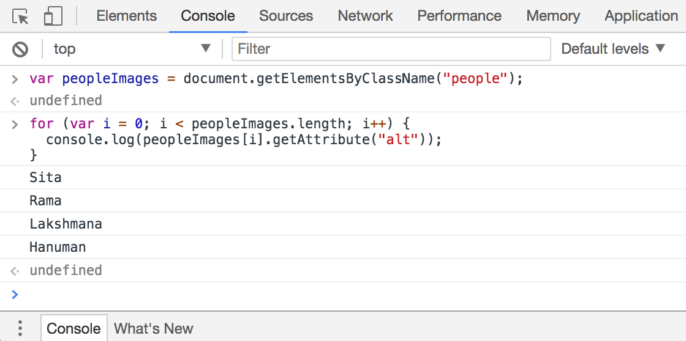
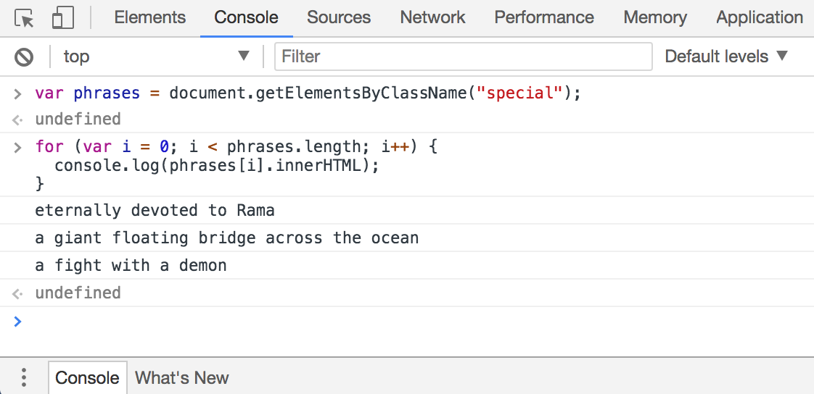

# Practice with JavaScript methods and the DOM

This very small repo contains a simple HTML page with headings, paragraphs and images. Various `id` and `class` attributes have been inserted to facilitate practicing in the JavaScript Console in Chrome for beginners.

## How to use the practice page

1. [Open the page](https://macloo.github.io/practice-with-DOM) in Chrome.

2. Open the JavaScript Console.

3. Experiment with JavaScript methods for getting information out of the DOM, as shown in the images below. These images also appear at the bottom of the page.

<kbd></kbd>

<kbd></kbd>

<kbd></kbd>

<kbd></kbd>
